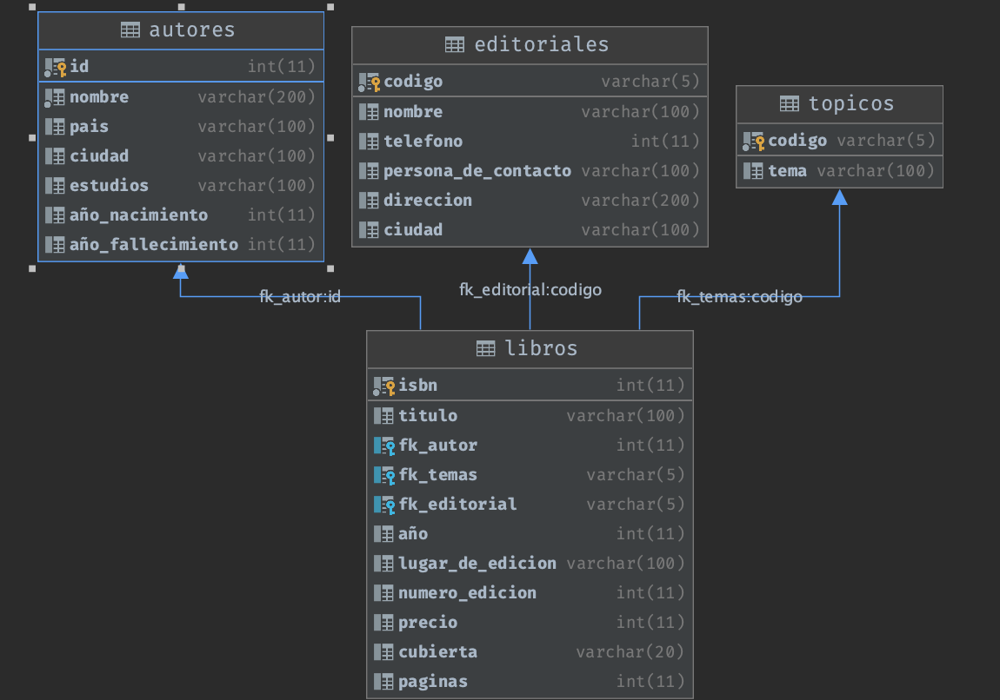

# Introducción a Microservicios con Flask y Docker

__Hola! gracias por entrar a este repositorio :smile:__

__La idea del proyecto es levantar un microservicio de APIs para una librería, siguiendo la idea de la [presentación](./assets/Introduccion_microservicios_con_Flask.pdf)__

## Consideraciones:
1. Este es un proyecto __de nivel básico__, por lo cual, no se trabaja con .env, archivos de configuración ni características muy complejas.
2. Si deseas transformarlo en un proyecto de nivel más avanzado, te recomiendo encarecidamente tomar las precauciones:
    - Setear una password más segura para la base datos (dentro del archivo docker-compose.yml)
    - Guardar las credenciales en un archivo [.env](https://pypi.org/project/python-dotenv/) y/o en una tabla de la base de datos.
    - Ordenar el proyecto con [Blueprints](https://flask.palletsprojects.com/en/2.0.x/tutorial/views/) de flask.
3. El objetivo del proyecto es sólo demostrar como podemos armar un servicio que realice lo siguiente:
    - Consultar información a la base de datos
    - Agregar/Eliminar registros en la base de datos
    - Proteger los endpoint de administración con una api de autentificación.
    - Mezclar ambos servicios en un docker-compose. 

## Instalación
1. Construir el docker-compose con el siguiente comando:

    ```bash
    docker-compose up -d
    ```

2. Cargar el archivo __api-demo-dump.sql__ en la base de datos, para esta tarea te recomiendo utilizar una herramienta para conectarte a la base de datos, como por ejemplo puede ser [DBeaver](https://dbeaver.io/download/), [Sequel Pro](https://sequelpro.com/) o [MySQL Workbench](https://dev.mysql.com/downloads/workbench/).
    
3. Si lograste cargar exitosamente el dump a la base de datos, deberías tener el siguiente modelo E/R.
 
 
    
4. Consultar algún endpoint para verificar si existe conexión a la base de datos.

5. Si el 4to paso resultó exitoso, estás listo para comenzar a explorar y modificar el microservicio!